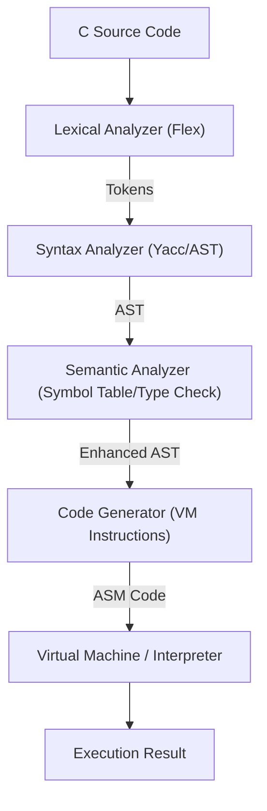

# 🚀 C_Compiler_Front
**From Scratch C 컴파일러 프론트엔드 & 가상 머신**
Lexical, Syntax, Semantic Analysis 전 과정을 직접 구현했습니다.  
소스 코드가 해석되어 실제 실행되는 컴파일러 전단부의 흐름을 깊게 이해하는 것이 목표입니다.

## 🏗 아키텍처 (Architecture)


## 🛠 해결한 문제 (Problem Solving)
### 1. 다중 스코프 및 전방 참조 처리
- **문제** - 블록 스코프와 구조체 상호 참조로 인해 선언 순서 및 변수 섀도잉 처리가 까다로웠습니다.
- **접근** - 식별자의 스코프 레벨과 이전 스코프 연결을 추적하는 계층적 시스템이 필요했습니다.
- **해결** - `A_ID`에 `level`, `prev` 포인터를 도입하고 계층형 심볼 테이블을 구축하여 해결했습니다.

### 2. 타입 일관성 및 묵시적 형변환
- **문제** - 포인터 연산, 배열 decay 등 복잡한 C 타입 규칙을 VM 명령어에 정확하게 매핑해야 했습니다.
- **접근** - 로직 파편화를 막기 위해 AST 순회 중 타입 정보를 전파하고 형변환 노드를 삽입했습니다.
- **해결** - 30여 개의 세만틱 유틸리티를 구현하여 AST 단계에서 오류를 차단하고 안정성을 확보했습니다.

## ✨ 주요 기능 (Key Features)
- **타입 지원** - `int`, `float`, `char`, 포인터, 배열, 구조체 지원
- **제어 흐름** - `if-else`, `while`, `for`, `break`, `return` 구현
- **함수/IO** - 스택 프레임 관리 및 `printf`, `scanf`, `malloc` 구현
- **VM 환경** - 중간 코드를 실행하는 스택 기반 인터프리터 제공

## 🛠 기술 스택 (Tech Stack)
- **Language** - C
- **Tools** - Flex(Lex), Bison(Yacc), GCC, Make

## 💡 성장 및 계획
- **배운 점** - LR파서의 동작 원리와 문법 설계의 중요성을 체감하며 컴파일러의 전단부에 대해 깊게 이해했습니다.
- **향후 계획** - 최적화 추가 및 x86-64 어셈블리 백엔드 확장을 계획 중입니다.

## 🛠 빌드 및 실행
완성도가 가장 높은 `5_Code_Generation` 기준으로 작성된 메뉴얼입니다.

### 1. 컴파일러 & VM 빌드
```bash
# 컴파일러 빌드
cd 5_Code_Generation/compiler && make
# 인터프리터(VM) 빌드
cd ../interpreter && make
```

### 2. 실행 방법
```bash
./a.out < input.c      # a.asm(어셈블리) 생성
./interpreter a.asm    # VM으로 실행
```
